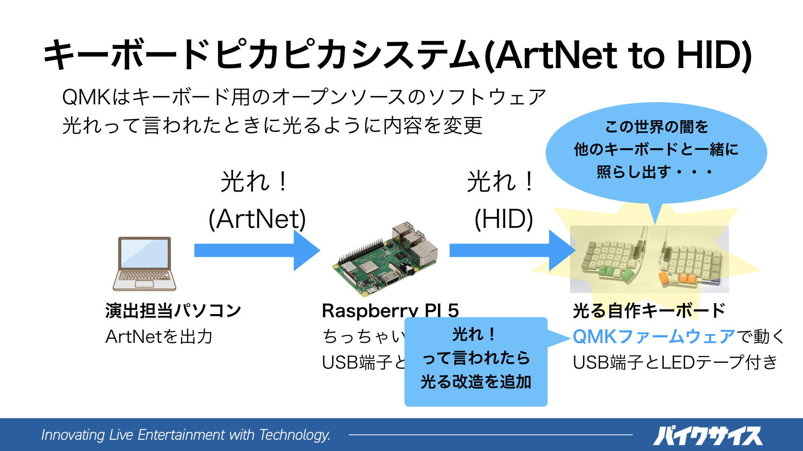

# キーボードピカピカシステム
キーボードピカピカシステムは、 [2024年3月24日に秋葉原 Mogra で開催予定の Keysounds!!! #2 ](https://club-mogra.jp/2024/03/24/5184/)にお持ちいただいた皆様のキーボードを、演出の一部として外部よりコントロール可能とする仕組みです。

 

## ざっくりとした仕組み
キーボードから、キーボードピカピカシステムへの接続は、当日会場に設置予定の Raspberry PI 5 に接続された USB ハブに対して行うことを予定しています。

Raspberry PI 5 からキーボードへのLEDの点灯情報の送信は、 QMK ファームウェアが用意する Raw HID と呼ばれる 、HID インタフェースを介して QMK ファームウェアとホストコンピュータ間の双方向通信を可能とする仕組みにより行います。

Raw HID については[こちら](https://github.com/qmk/qmk_firmware/blob/master/docs/ja/feature_rawhid.md)に説明があります。

## キーボードピカピカシステムに接続するキーボードの準備
キーボードピカピカシステムに接続するキーボードは、このドキュメントで説明する Raw HID により LED の点灯をコントロールする仕組みを追加した QMK ファームウェア(以下、QMK ピカピカファームウェアと記載)をコンパイルし書き込む必要があります。

この現時点では以下の 1. と 2. 条件を満たすキーボード（キーマップ）向けの QMK ピカピカファームウェアのコンパイルが可能です。

1. rgblight を用いてコントロールされる LED を搭載している。
   - rgblight の詳細は[こちら](https://github.com/qmk/qmk_firmware/blob/master/docs/feature_rgblight.md)
   - 現時点では、 rgb_matrix を用いた制御を行う LED を搭載したキーボードには対応していません。これは、手元に対応するキーボードがなく確認ができないためです。しかし、仕組みはシンプルであり、 rgb_matrix は、rgblight と内部的な互換性を保つためのレイヤーを用意しているため、追加での対応は容易かもしれません。
     - rgb_matrix については[こちら](https://github.com/qmk/qmk_firmware/blob/master/docs/feature_rgb_matrix.md)
2. Raw HID を用いていないキーマップを利用していること。
   - 例えば、 VIA コンフィグレーターは、内部的には Raw HID を用いて実現されています。このような場合には Raw HID を用いるための定義が重複し、QMK ピカピカファームウェアのコンパイルに失敗します。一般的に VIA コンフィグレータ対応のキーマップを用意しているキーボード向けには、 VIA コンフィグレータを用いないキーマップも用意されていますので、こちらをコンパイルし書き込んでしてください。

ピカピカファームウェアは[こちらの git レポジトリ](https://github.com/sirrow/qmk_firmware/)の pikapika ブランチにあります。pikapika ブランチを checkout した後、qmk compile コマンドでコンパイルの後、書き込みを行ってください。

**書き込みを行うとキーボードに保存されているキーマップや設定がリセットされてしまいます。書き込みに先立ち、現状復帰ができる状態にあることを確認してください。**

### TIPS
- `rgbmatrix`はオフにして`rgblight`だけの環境だと安心です
- 明るさの最大値、`MAX_BRIGHTNESS` は、`100`ぐらいで十分です
  * LEDの個数によるので消費電流500mAぐらいを目安に設定してください 
- LEDのアニメーションモードは常時`RGBLIGHT_MODE_STATIC_LIGHT`である必要があります

### 他の方法
上で説明しているQMKピカピカファームウェアがうまく使えない場合のために、[他の方法もあります](alternative_method.md)。

## キーボードピカピカシステムに接続可能となったかの確認方法
下記 Web サイトにアクセスして「CONNECT」ボタンを押して、キーボードを選択したのち、LED の色の変更ができれば成功です。

[https://hsgw.github.io/hid-rgbled-tester/](https://hsgw.github.io/hid-rgbled-tester/)

Linux を用いている場合、一般ユーザから HID デバイスにアクセスするための権限が不足しているため、追加での設定が必要となる場合があります。追加設定については[こちらを参照ください](linux_hid_permission.md)。

## 連絡先
不明な点も多いかと思います。ご質問が有りましたら、私の twitter アカウント [@sirrow](https://twitter.com/sirrow) までご連絡ください。